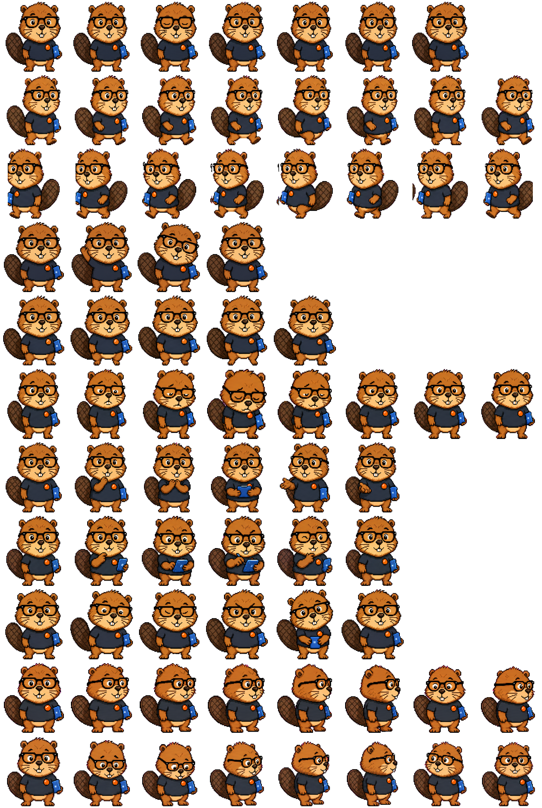

# 小海狸 · Codex 原生桌宠

“小海狸”是一只为 Codex Desktop 设计的原创像素桌宠：戴黑框眼镜、穿深色短袖，胸前有橙色纽扣徽章，带着蓝色工作板和具有网格纹理的扁尾。

它代表三种工作状态：核验资料、整理知识工作流，以及向观众解释 AI 工具。



## 特点

- Codex 原生宠物图集 v2
- 透明背景，不会出现白色底板
- 8 × 11 动作图集，尺寸为 1536 × 2288
- 包含待机、奔跑、跳跃、挥手、核验资料和方向观察等动作
- 不使用 OpenAI 或 Codex 官方 Logo

## 安装

### 方法一：下载压缩包

1. 在仓库右侧的 **Releases** 中下载 `xiaohaili-codex-native-v1.zip`。
2. 解压后得到 `xiaohaili` 文件夹。
3. 将整个文件夹放入：

   ```text
   ~/.codex/pets/
   ```

   最终目录应为：

   ```text
   ~/.codex/pets/xiaohaili/pet.json
   ~/.codex/pets/xiaohaili/spritesheet.webp
   ```

4. 完全退出并重新打开 Codex。
5. 在宠物选择器中选择“**小海狸**”。

### 方法二：从仓库复制

下载或克隆仓库后，将仓库中的 `xiaohaili` 文件夹复制到 `~/.codex/pets/`，再重新启动 Codex。

## 文件说明

```text
xiaohaili/                  可直接安装的宠物目录
├── pet.json                Codex 宠物清单
└── spritesheet.webp        透明动作图集
preview/spritesheet.png     高清预览图
qa/validation.json          图集规格验证结果
release/                    可直接下载的安装压缩包
```

## 验证结果

- 格式：WebP RGBA
- 图集：8 列 × 11 行
- 规格：Codex pet sprite version 2
- 透明像素 RGB 残留：0
- 校验错误：0

## 说明

这是个人创作的 Codex 自定义桌宠项目，不是 OpenAI 官方素材或官方产品。
